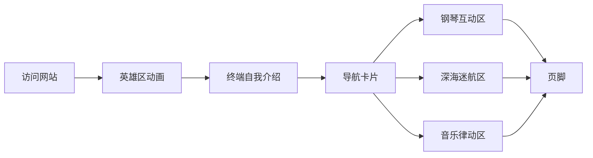

## 1. 产品概述

袁沁的个人介绍网站，以科技感、幽默、抽象为设计风格，展示个人爱好与特色。通过赛博朋克视觉元素、趣味交互和抽象表达方式，打造一个令人印象深刻的个人名片网站。

## 2. 核心功能

### 2.1 功能模块

1. **首页英雄区**： glitch效果标题、动态粒子背景、科技感标语
2. **个人介绍终端**：模拟终端界面的自我介绍，打字机动画效果
3. **爱好导航卡片**：钢琴、深海迷航、音乐三大爱好入口
4. **钢琴互动区**：可点击弹奏的虚拟钢琴键盘，带音频反馈
5. **深海迷航探索区**：深海主题展示，潜水深度进度条，抽象幽默文案
6. **音乐律动区**：动态波形可视化，音乐态度表达

### 2.2 页面详情

| 页面名称 | 模块名称 | 功能描述 |
|----------|----------|----------|
| 首页 | 英雄区 | Glitch文字动画、霓虹标题、粒子飘浮背景 |
| 首页 | 终端介绍 | 模拟Linux终端，打字机效果逐行显示个人简介 |
| 首页 | 导航卡片 | 三个爱好图标卡片，悬停动画，点击滚动到对应区域 |
| 首页 | 钢琴区 | 12键虚拟钢琴，点击播放对应音符，悬停变色效果 |
| 首页 | 深海迷航区 | 深海潜水深度计、海洋生物ASCII艺术、幽默文案 |
| 首页 | 音乐区 | 动态音频波形条、频率跳动动画、个性化签名 |

## 3. 核心流程

用户访问网站 → 看到glitch动画标题 → 阅读终端中的个人介绍 → 点击导航卡片或直接滚动 → 体验各个爱好互动区域 → 浏览页脚

## 4. 用户界面设计

### 4.1 设计风格

- **主色调**：赛博朋克风格，深黑背景 (#050510)，霓虹青 (#00ffff) 和霓虹紫 (#ff00ff) 作为强调色
- **辅助色**：深海蓝 (#0066ff)、荧光绿 (#00ff00)
- **按钮/卡片风格**：毛玻璃效果，霓虹边框，悬停发光和位移
- **字体**：Orbitron（科技感标题）+ Noto Sans SC（中文正文）
- **布局风格**：单页滚动，卡片分区，终端模拟
- **图标风格**：emoji + SVG图标混合

### 4.2 页面设计概览

| 页面名称 | 模块名称 | UI元素 |
|----------|----------|--------|
| 首页 | 英雄区 | Glitch文字效果、霓虹边框、粒子背景动画 |
| 首页 | 终端介绍 | 终端窗口样式、打字机动画、绿色代码文字 |
| 首页 | 导航卡片 | 毛玻璃卡片、悬停旋转动画、发光边框 |
| 首页 | 钢琴区 | 虚拟黑白琴键、点击音效、悬停变色 |
| 首页 | 深海迷航区 | 深海渐变背景、潜水深度条、海洋生物ASCII、气泡动画 |
| 首页 | 音乐区 | 动态波形条、渐变色频率条、跳动动画 |

### 4.3 响应式设计

- 桌面端优先设计，移动端自适应
- 平板/手机端导航卡片改为纵向排列
- 标题文字在小屏幕自动缩小
- 钢琴键盘在小屏幕可横向滚动
