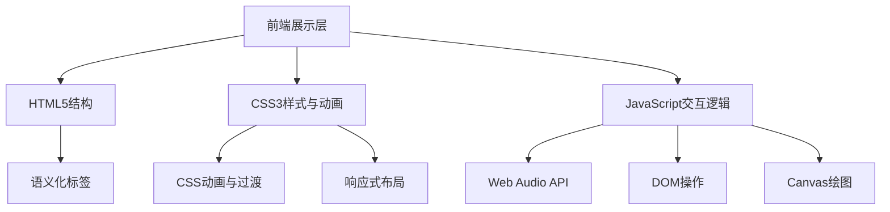

## 1. 架构设计



## 2. 技术说明

- **前端**：原生 HTML5 + CSS3 + JavaScript (ES6+)
- **动画实现**：CSS3 @keyframes 动画 + JavaScript Web Animations API
- **音频处理**：Web Audio API 用于钢琴音符播放
- **图形渲染**：Canvas 2D 用于 Matrix 雨效果
- **无后端**：纯静态网站，无需服务器端逻辑
- **构建工具**：无，直接运行的静态文件

## 3. 文件结构

```
q7153/
├── index.html          # 主页面结构
├── style.css           # 样式与动画定义
├── script.js           # 交互逻辑与动画控制
└── .trae/
    └── documents/      # 项目文档
        ├── 袁沁个人网站-产品需求文档.md
        └── 袁沁个人网站-技术架构文档.md
```

## 4. 核心功能实现

### 4.1 Glitch 文字效果

使用 CSS text-shadow 多层叠加 + clip-path 动画实现文字故障效果。通过伪元素 ::before 和 ::after 创建偏移的文本副本，配合关键帧动画实现随机闪烁和位移。

### 4.2 粒子背景系统

JavaScript 动态创建 DOM 元素作为粒子，使用 CSS 动画控制飘浮轨迹。随机化粒子的位置、延迟、持续时间和颜色（青色/紫色），营造科技感氛围。

### 4.3 终端打字机效果

CSS 动画控制文字逐行淡入，配合闪烁光标营造终端输入效果。文字内容模拟 Linux 终端输出格式，使用等宽字体和绿色配色。

### 4.4 虚拟钢琴交互

- 使用 Web Audio API 创建 OscillatorNode 生成正弦波
- 12个琴键对应 12 个标准音高频率 (C4-B4)
- 点击触发音符播放，0.5秒自然衰减
- 悬停时琴键变色（白键变青色，黑键变紫色）

### 4.5 Matrix 雨效果

Canvas 2D 绘制经典 Matrix 字符下落效果：
- 随机字符集包含中英文和符号
- 每列独立下落，到达底部后随机重置
- 使用半透明矩形覆盖实现拖尾效果
- 固定 30fps 刷新率

### 4.6 科乐美秘籍彩蛋

监听键盘事件，检测经典 ↑↑↓↓←→←→BA 序列：
- 触发后全屏彩虹色相旋转动画
- 50个彩色纸屑从天而降
- 5秒后自动恢复正常状态

## 5. 性能优化

- CSS 动画优先使用 transform 和 opacity，启用 GPU 加速
- Canvas 绘制控制刷新率，避免过度渲染
- 粒子数量限制在 30 个以内
- 音频上下文按需创建，播放后自动释放
- 使用 IntersectionObserver 实现滚动动画，减少不必要的重排

## 6. 浏览器兼容性

- 支持所有现代浏览器 (Chrome 90+, Firefox 88+, Safari 14+, Edge 90+)
- Web Audio API 需要用户交互后才能播放音频
- CSS backdrop-filter 在不支持的浏览器中会优雅降级
- Canvas 2D 广泛支持，无兼容性问题
